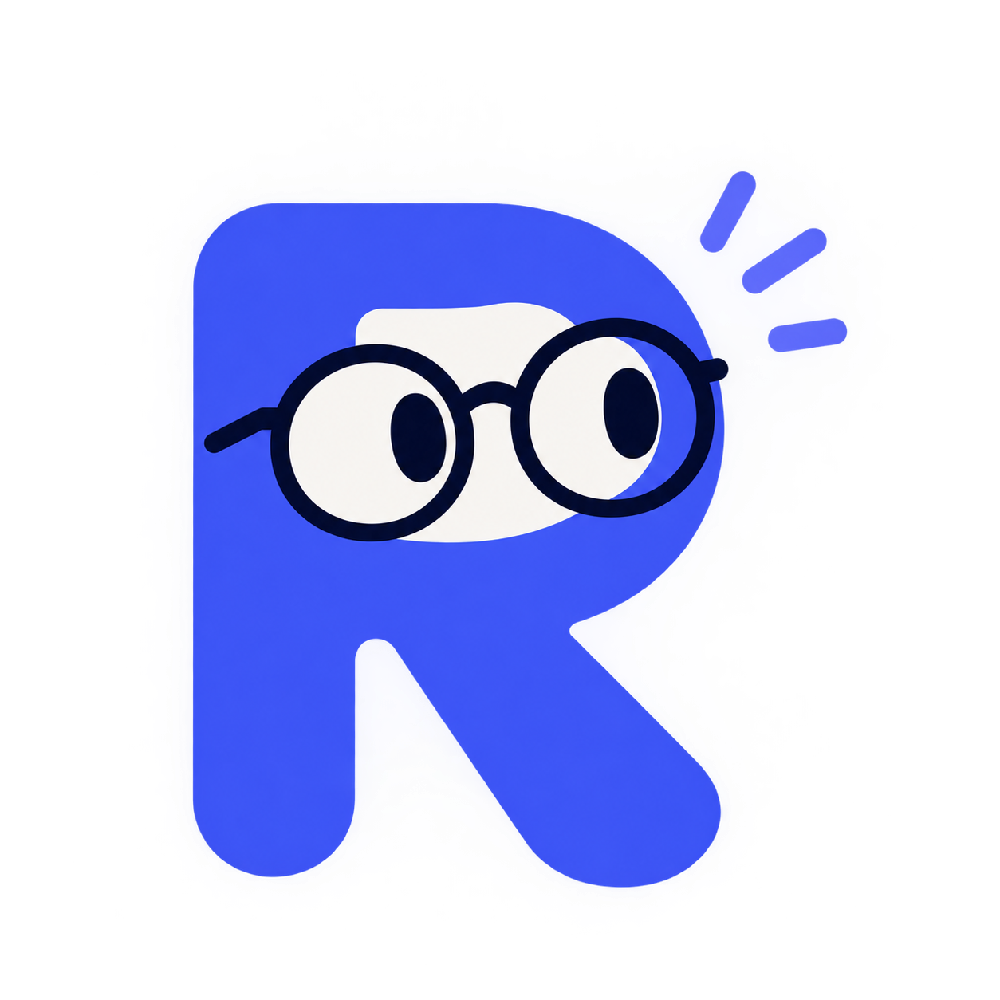

<div align="center">



# Rym Ines Bouchama : Portfolio

**Ingénieure IA & logiciel · AI & Software Engineer**

Portfolio personnel bilingue (FR / EN), sombre ou clair, animé mais sobre.


</div>

---

## ✨ Fonctionnalités

- 🌗 **Mode nuit / jour** — suit le thème du système par défaut, choix mémorisé, contraste WCAG AA vérifié dans les deux thèmes.
- 🌍 **Français / anglais** — langue choisie selon le navigateur, bouton `FR | EN`, choix mémorisé, textes dans des fichiers de traduction.
- 🟣 **Pluie de chiffres binaires** sur les sections sombres, dessinée sur un `<canvas>` : en pause hors écran et figée si le mouvement réduit est activé.
- 🧩 **Grille « profil » en blocs** (bento), projet phare mis en avant et cartes de projets alignées en 16:9.
- 🔁 **Compétences en défilement continu** : une ligne par catégorie, sens alterné, pause au survol, logo en couleur au survol.
- 🖐️ **Illustrations SVG animées** quand un projet n'a pas de capture (21 points de repère MediaPipe, analyse d'image abstraite).
- 🗓️ **Frise de parcours** par année, section recherche et leadership.
- 📄 **Téléchargement du CV** depuis le header, le hero et le pied de page.
- 🍉 Une petite pastèque dans le header, en soutien à la Palestine.

## ♿ Accessibilité & performance

- Respect de `prefers-reduced-motion` : défilement figé en grille, apparitions sans mouvement, pluie immobile.
- Focus visible, lien d'évitement, textes alternatifs, cibles tactiles confortables.
- Images via `next/image` : AVIF / WebP, chargement différé, hauteur réservée (pas de saut de page).
- Les originaux de `public/images/` ne sont jamais modifiés ; les images qui ne remplissent pas leur cadre sont affichées en entier, sans agrandissement flou.
- Chaque image reçoit une version (`?v=`) liée à sa date de modification : une image remplacée n'est jamais servie depuis un vieux cache.

## 🛠️ Stack

| Rôle | Outil |
| --- | --- |
| Framework | Next.js 16 (App Router, pages statiques) |
| Style | Tailwind CSS 4, jetons de couleur en variables CSS |
| Animations | Framer Motion + CSS |
| Thème | next-themes |
| Icônes | Simple Icons (logos), Lucide (interface) |
| Polices | Space Grotesk & Inter via `next/font` |

## 🚀 Démarrer

Prérequis : Node.js 20 ou plus.

```bash
npm install
npm run dev      # http://localhost:3000
```

Construire la version de production :

```bash
npm run build
npm start
```

## 🗂️ Structure

```
public/
  cv/              CV téléchargeable (PDF)
  images/          photos et captures (jamais modifiées)
src/
  app/[lang]/      page, layout et icônes, une route par langue (/fr, /en)
  components/
    sections/      Hero, Stats, Projets, Compétences, Recherche…
    ui/            cadre d'image, logos, animations d'apparition
    art/           illustrations SVG des projets sans capture
  content/         liens, projets, technologies (données non traduites)
  i18n/            fr.json et en.json (tous les textes)
  lib/images.ts    détection des images et de leurs dimensions
  proxy.ts         redirection vers /fr ou /en
```

## ✏️ Personnaliser

| Je veux… | Où |
| --- | --- |
| Modifier un texte | `src/i18n/fr.json` et `src/i18n/en.json` |
| Changer le CV | remplacer `public/cv/Bouchama_Rym_Ines.pdf` |
| Changer une image | remplacer le fichier dans `public/images/` (même nom, `.png`, `.jpg` ou `.webp`) |
| Ajouter un logo de technologie à un projet | champ `stack` dans `src/content/site.ts` |
| Modifier les liens (e-mail, GitHub, LinkedIn) | `src/content/site.ts` |
| Ajuster les couleurs | variables CSS dans `src/app/globals.css` |

Pour remplacer une illustration par une vraie capture, il suffit d'ajouter `sign-language-1.png` ou `dermoscan-1.png` dans `public/images/`. Si une image manque, un emplacement propre s'affiche à la place, jamais une image cassée.

## ☁️ Déploiement

Le site se déploie sur [Vercel](https://vercel.com) sans aucune configuration : importer le dépôt, puis **Deploy**. Chaque `git push` sur `main` redéploie automatiquement.

## 📬 Contact

- ✉️ [bouchamarymines@gmail.com](mailto:bouchamarymines@gmail.com)
- 💻 [github.com/rymbouchama](https://github.com/rymbouchama)
- 💼 [linkedin.com/in/rym-bouchama](https://www.linkedin.com/in/rym-bouchama)

---

<div align="center">
<sub>Conçu et développé par Rym Ines Bouchama · © 2026</sub>
</div>
